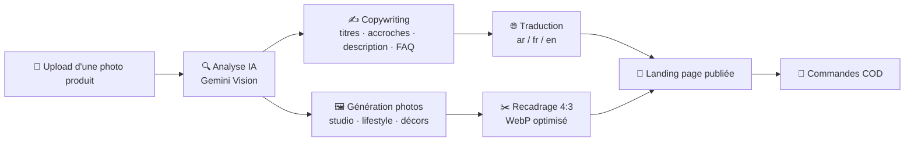

<div align="center">

# 🛍️ WeeSaaS

### La plateforme qui transforme **une simple photo** en **page de vente complète** — en quelques minutes.

*Upload une image produit → l'IA rédige, shoote en studio, traduit et publie une landing page prête à convertir. Le tout en `ar` / `fr` / `en`, avec paiement à la livraison.*

<br>


</div>

---

## 🚀 La vraie valeur

La création d'une fiche produit e-commerce qui convertit, c'est normalement : un photographe, un copywriter, un traducteur, un intégrateur, et des jours de travail.

**WeeSaaS fait tout ça à partir d'une seule photo, automatiquement.**

| Sans WeeSaaS | Avec WeeSaaS |
|---|---|
| 📸 Shooting photo studio | ➡️ **IA génère des photos studio ultra-pro** (hero, lifestyle, décors) |
| ✍️ Rédacteur (titres, accroches, description, FAQ) | ➡️ **IA rédige tout le copywriting** orienté conversion |
| 🌐 Traducteur ar / fr / en | ➡️ **Multilingue natif** avec support RTL |
| 🧑‍💻 Intégrateur de la landing page | ➡️ **Page générée et publiée** automatiquement |
| ⏳ Plusieurs jours | ➡️ **Quelques minutes, en un clic** |

> 💡 Et pour les pages institutionnelles (À propos, Contact, FAQ, CGV…) :
> **quelques mots suffisent** → l'IA rédige la page complète.

---

## ✨ Fonctionnalités

### 🎨 Génération par IA
- **Produit depuis une image** — analyse visuelle (Gemini Vision), copywriting complet, et **génération de photos studio** (modèle *Nano Banana 2* + repli) : photo principale héro, lifestyle cadrée, décors variés, tout recadré en **paysage 4:3**.
- **Régénération image par image** — un bouton par visuel dans l'éditeur pour relancer un seul rendu sans tout refaire.
- **Pages statiques en quelques mots** — À propos, Contact, FAQ, CGV… rédigées par GPT-4o, avec **repli automatique** si l'IA est indisponible.

### 🛒 Boutique & ventes
- Pages produit **multilingues** (`ar` / `fr` / `en`) avec **RTL**.
- **Tunnel de commande COD** (paiement à la livraison) avec frais de livraison configurables.
- Galerie premium + **lightbox carrousel**, hero avec changement de photo fluide.
- Gestion du **stock** (suivi ou illimité) avec affichage « Épuisé » automatique.
- Codes promo, avis clients, villes par pays.

### 📊 Panneau d'administration (`/weeadmin`)
- **Dashboard**, commandes, clients, **analytics** (live, funnel, appareils, villes, trafic par page).
- **Notifications** intégrées (nouvelle commande, etc.).
- **Logs ultra-détaillés** de chaque génération (produit/page) + console système, avec purge manuelle.
- Menus, pages, réglages boutique, clés API.

### ⚙️ Plateforme
- **File d'attente** (driver base de données) avec **worker auto-démarré** en un clic.
- **SEO avancé** : données structurées (`Product`, `WebSite` + SearchAction), Open Graph / Twitter Cards, sitemap, canonical.
- **Installateur web** `install.php` + guide cPanel — déploiement client sans ligne de commande.

---

## 🧠 Comment ça marche



1. **Tu uploades une image** et renseignes le prix (et quelques options).
2. Un **Job en file d'attente** lance la génération (le worker démarre tout seul).
3. L'IA **analyse, rédige, traduit et shoote** le produit.
4. La **page de vente est publiée** — prête à recevoir des commandes.

---

## 🏗️ Stack technique

| Couche | Technologie |
|---|---|
| **Framework** | Laravel 12 (PHP 8.2+) |
| **Base de données** | MySQL / MariaDB |
| **IA texte & vision** | Google **Gemini** (`gemini-2.5-flash`) · OpenAI **GPT-4o** |
| **IA image** | **Nano Banana 2** (`gemini-3.1-flash-image-preview`) + repli `gemini-2.5-flash-image` |
| **Traitement image** | GD (recadrage center-crop 4:3 → WebP) |
| **File d'attente** | Queue Laravel (driver `database`) + worker auto |
| **Front** | Blade · CSS/JS natifs (galerie, lightbox, tracking) |

---

## 📦 Installation

### Option A — Installateur web (recommandé pour la prod / cPanel)

Ouvre simplement **`https://ton-domaine.com/install.php`** : l'assistant vérifie le
serveur, configure la base, écrit le `.env`, lance les migrations, crée l'admin,
puis **se supprime tout seul**.

👉 Guide complet cPanel pas-à-pas : **[INSTALL.md](INSTALL.md)**

### Option B — Développement local

```bash
# 1. Dépendances
composer install

# 2. Configuration
cp .env.example .env
php artisan key:generate

# 3. Base de données (créer la base, puis)
php artisan migrate

# 4. Lancer (serveur + queue + logs + assets)
composer run dev
#   ou simplement :
php artisan serve            # http://127.0.0.1:8000
```

> 🪟 **XAMPP/Windows** : préfixer le PATH par `C:\xampp\php;C:\xampp\mysql\bin`.

> 🔄 **Migration depuis l'ancienne base** (optionnel) :
> `php artisan weesaas:import-legacy --fresh`

L'administration est accessible sur **`/weeadmin`** (compte créé à l'installation).

---

## ⚙️ Configuration (`.env`)

La configuration se fait via le fichier **`.env`** (copié depuis `.env.example`).

> 🔒 **Le `.env` n'est JAMAIS versionné** (il est dans `.gitignore`) : il contient
> tes secrets. Ne le publie jamais sur un dépôt public.

| Variable | Rôle |
|---|---|
| `APP_ENV` | `local` en dev, **`production`** en prod |
| `APP_DEBUG` | `true` en dev, **`false`** en prod (sinon fuite des erreurs) |
| `APP_KEY` | Clé de chiffrement (générée par `php artisan key:generate`) |
| `APP_URL` | URL publique du site |
| `DB_CONNECTION` | `mysql` |
| `DB_HOST` · `DB_PORT` · `DB_DATABASE` · `DB_USERNAME` · `DB_PASSWORD` | Connexion base de données |
| `WEESAAS_DEFAULT_LANG` | Langue par défaut (`fr` / `ar` / `en`) |
| `WEESAAS_LEGACY_ENCRYPTION_KEY` | Clé de chiffrement des réglages sensibles |

> 🧠 **Clés API IA** (Gemini / OpenAI) : elles ne se mettent **pas** dans le `.env` —
> elles sont saisies dans **`/weeadmin → Réglages`** et stockées **chiffrées** en base.

> ⚠️ **Avant la production** : `APP_ENV=production`, `APP_DEBUG=false`, et supprimer
> `public/install.php` (l'installateur le fait automatiquement).

---

## 🗂️ Structure du projet

```
app/
├── Http/Controllers/
│   ├── Admin/            # Dashboard, produits, pages, analytics, logs, réglages…
│   └── *.php             # Front : catalogue, produit, commande, suivi, tracking
├── Jobs/
│   └── GenerateProductPage.php   # Pipeline de génération produit (asynchrone)
├── Services/
│   ├── AI/GeminiService.php      # Vision + génération d'images studio
│   ├── AI/OpenAiService.php      # Copywriting & pages statiques
│   ├── ImageService.php          # Recadrage 4:3 → WebP
│   ├── AdminAuth.php             # Auth admin (bcrypt, anti-bruteforce, sessions IP)
│   ├── TrackingService.php       # Analytics & vues
│   └── GenerationLogger.php      # Logs de génération détaillés
├── Models/                       # Eloquent (Product, Order, Admin, Setting…)
└── Http/Middleware/
    ├── EnsureAdmin.php           # Garde des routes /weeadmin
    └── SecurityHeaders.php       # CSP, HSTS, X-Frame-Options…
public/install.php                # Assistant d'installation auto-destructible
```

---

## 🔐 Sécurité

WeeSaaS applique les bonnes pratiques par défaut :

- 🔑 **Auth admin** : mots de passe **bcrypt**, **anti-bruteforce** (5 essais / 15 min par IP), sessions **liées à l'IP** + expiration, régénération anti-fixation.
- 🛡️ **CSRF** activé sur toutes les requêtes (sauf le beacon de tracking).
- 🧱 **En-têtes de sécurité** : `Content-Security-Policy`, `HSTS` (HTTPS), `Permissions-Policy`, `X-Frame-Options`, `X-Content-Type-Options`, `Referrer-Policy`.
- 🚦 **Rate-limiting** sur les endpoints publics (commande, formulaires).
- 🧬 **Anti-injection** : Eloquent partout, valeurs castées dans les rares requêtes brutes.
- 📤 **Uploads validés** (types raster sûrs uniquement, taille limitée).
- 🧹 L'installateur se **verrouille et s'auto-supprime** après usage.

> ⚠️ Avant la mise en production : `APP_ENV=production`, `APP_DEBUG=false`, et supprimer `public/install.php` (l'installateur le fait pour toi).

---

## 🌍 SEO & multilingue

- Données structurées **Schema.org** (`Product` avec offre/disponibilité/notes, `WebSite` + `SearchAction`).
- **Open Graph** & **Twitter Cards** dynamiques (`og:type` adapté, `og:locale`, `site_name`).
- **Sitemap** automatique, URL canoniques propres, `robots`.
- Langues **`ar` / `fr` / `en`** avec direction **RTL** gérée nativement.

---

## 🛠️ Commandes utiles

| Commande | Rôle |
|---|---|
| `php artisan weesaas:doctor` | Diagnostic de l'environnement |
| `php artisan weesaas:check-engine` | Vérifie la configuration IA |
| `php artisan weesaas:check-generation` | Teste le pipeline de génération |
| `php artisan weesaas:fresh-start --force` | Repart d'une boutique propre (config conservée) |
| `php artisan weesaas:import-legacy --fresh` | Importe l'ancienne base de données |
| `php artisan queue:work --stop-when-empty` | Traite la file de génération |

---

## 📄 Licence

Distribué sous licence **MIT** — voir le fichier [LICENSE](LICENSE).

> © 2026 **WeeSaaS — Serrafi Yassine**. La mention de copyright **WeeSaaS** et de l'auteur
> **Serrafi Yassine** doit être conservée dans toute copie ou portion substantielle du logiciel.

---

<div align="center">

**WeeSaaS** — *De la photo à la vente, en quelques minutes.* 🚀

</div>
